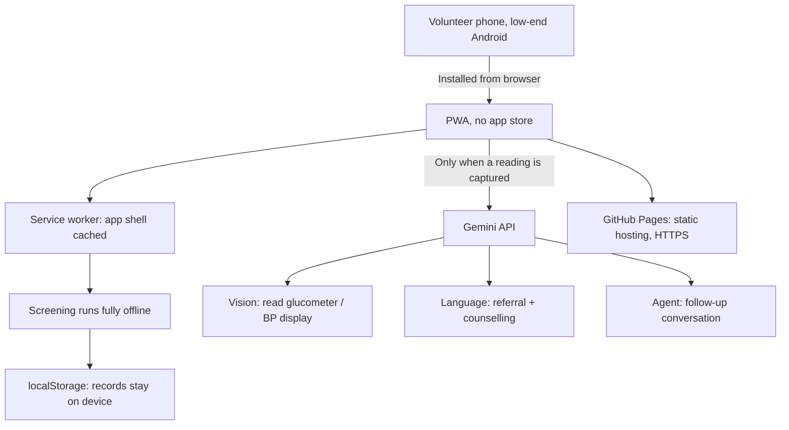

# Sehat Ledger: Technical Architecture

*Describes what was actually built in this repository, not what was planned.*

---

## The constraint that decided everything

A volunteer in a basement prayer hall with no signal, on a phone that cost less
than the diagnostic kit, must be able to complete a screening. Every choice
below follows from that one sentence.

That constraint rules out more than it rules in. No login wall. No network
round-trip in the critical path. No framework that ships 200KB before the first
screening. No build step that has to succeed before anyone can fix a bug on the
day.

---

## Architecture

---

## 1. Frontend: vanilla ES modules, no framework

| | React + Vite | What was built |
|---|---|---|
| Install size | ~140KB before any app code | 0KB framework |
| Build step | Required before anything runs | None |
| Fix a bug at 6pm on build day | Edit, rebuild, redeploy, hope | Edit the file, refresh |
| Who can contribute | Whoever knows React | Anyone who can read HTML |

Six ES modules loaded natively by the browser. No bundler, no transpiler, no
`node_modules`, no lockfile. `git push` is the deploy.

For a build day with a mixed-skill team and a hard deadline, removing the build
step removes an entire category of failure.

**Module boundaries:**

| File | Responsibility | Lines |
|---|---|---|
| `clinical.js` | IDRS, BMI, BP, glucose, outcome escalation. Pure functions. | 267 |
| `ledger.js` | The zakat preservation model. Every assumption a named constant. | 249 |
| `ai.js` | Three Gemini calls, each with a deterministic mock fallback. | 494 |
| `app.js` | Routing, screening flow, camera, threads, rendering. | 1192 |
| `sw.js` | Offline shell. | 72 |
| `styles.css` | Design system. | 273 |

2,547 lines in total, plus 523 lines of tests.

`clinical.js` and `ledger.js` import nothing. That is deliberate: the two files a
clinician or a treasurer would want to audit are the two they can read without
understanding the rest, and the two that can be tested without a browser.

**`package.json` carries no dependencies.** It exists so Node treats `.js` as ESM
for `node --test`, and to name the `start` and `test` scripts. Deleting it would
not affect the deployed application.

## 2. Storage: on-device only

`localStorage`, holding a JSON array of screening records.

No backend. No database. No accounts. No sync.

This is the privacy design, not a shortcut. Health data collected by volunteers
never leaves the handset, so there is no server to breach, no credentials to
leak, and no third party in the chain.

Quota exhaustion on a low-end device is a real failure mode, so a failed write
surfaces to the volunteer rather than being swallowed.

**What this trades away:** multi-volunteer aggregation and a central committee
dashboard. Both are on the roadmap and both need a backend. Neither is needed to
prove the screening loop works.

**Migration path:** the record shape is already a flat, serialisable object.
Moving to Supabase with row-level security is additive, writing through to the
same objects that already exist locally.

## 3. Clinical logic

A deterministic rules engine, not a model. Every threshold is an exported named
constant so it can be checked against the source guideline line by line.

| Measure | Source | Note |
|---|---|---|
| IDRS | Madras Diabetes Research Foundation | Validated on an Indian cohort, which is why it is used over scores derived from European populations. Bands at 30 and 60. |
| BMI | ICMR / WHO Asia-Pacific | Overweight ≥23, obese ≥25. Using the WHO international 25/30 would under-refer exactly the people this programme exists to find. |
| Blood pressure | ICMR | Hypertension at 140/90 rather than the 2017 ACC/AHA 130/80. Graded on whichever limb is worse. Crisis at 180/110. |
| Glucose | ICMR / ADA | Fasting and random graded separately, because a volunteer in the field usually has only one. |

Escalation is deliberately conservative: any single urgent finding escalates the
whole record. `assess()` tolerates a partial record, because a field screening
often is one.

## 4. AI: Google Gemini

Three calls, each with a structured JSON response schema so output is parsed,
not scraped. All three route through one `callGemini` function, so there is one
place where failure is handled.

| Call | Model job |
|---|---|
| `readDeviceScreen` | Reads digits from a glucometer or BP monitor. Instructed to refuse rather than guess when the display is unclear. |
| `generateReferral` | Referral slip and counselling script in Urdu, Kannada, Hindi or Tamil, plus an English gloss so a supervisor can audit a language they do not read. |
| `followUpTurn` | Classifies the barrier, decides the action, escalates to a volunteer. |

**Every call degrades to a labelled mock.** The fallbacks are not stubs: the
follow-up mock implements the same barrier-resolution table the model is
instructed to use, so the demo shows real behaviour with no key. Mock output
carries `simulated: true` and a reason, and the UI renders both.

Requests are sent with `cache: 'no-store'` and a 12-second timeout.

## 5. Offline: service worker

Cache-first for the app shell. Model calls are never cached, because a stale
vital sign is a clinical hazard — cross-origin requests bypass the worker
entirely.

The shell is cached file-by-file rather than with `addAll`, which is atomic: one
404 would otherwise mean nothing caches at all and offline silently fails.

The worker activates immediately, claims clients, and the page reloads once when
a new worker takes control. A cache-first worker that serves yesterday's
JavaScript forever looks exactly like "my changes did nothing".

## 6. Testing

57 tests, zero dependencies, `node --test`.

| File | Covers |
|---|---|
| `test-clinical.js` | Every threshold and band boundary, escalation precedence, partial records, and the rule that patient-facing text never names a condition. |
| `test-ledger.js` | The honesty gate above all — that credit is *not* written for issued, escalated or routine referrals — plus pathway attribution and Indian digit grouping. |
| `test-flow.js` | The full two-minute demo, keyless, so the airplane-mode path is proven rather than assumed. |

A **Run self-test** button under Setup runs a short invariant check in the
browser, for machines with no Node.

## 7. Hosting: GitHub Pages

Static files, HTTPS, zero configuration, deploy on push.

HTTPS is not optional. Browsers only expose `getUserMedia` and service workers on
a secure context, so **without HTTPS there is no camera and no offline mode.** A
LAN IP will not do.

## 8. Distribution: no app store

Installed from the browser via the web manifest. Appears on the Android home
screen with its own icon and no browser chrome.

For an NGO this is the point. Rolling out to 100 centres means sending a link or
printing a QR code. No Play Store review, no signing keys, no update rollout, no
volunteer needing an account to install anything.

---

## Summary

| Layer | Choice | Why |
|---|---|---|
| Frontend | Vanilla ES modules | No build step, anyone can fix it, zero framework weight |
| Styling | One CSS file, custom properties | No preprocessor, no purge step |
| Type | System font stack | A linked font fails with no signal; self-hosting costs ~48KB on a field install |
| Storage | `localStorage` | No backend means no breach surface |
| Clinical | Deterministic rules, named constants | Auditable by a clinician without reading the app |
| AI | Gemini, structured output, mock fallback | Strong vision plus Indic coverage, and it never blocks a screening |
| Offline | Service worker, cache-first | The field has no connectivity |
| Hosting | GitHub Pages | HTTPS required for camera and install |
| Install | PWA from browser | 100 centres, no app store |

Total payload: **~125 KB** across 11 files, no images or webfonts.

---

## Deviations from the pre-build recommendation

Recorded so they are decisions rather than drift.

1. **System font stack instead of self-hosted Inter.** Costs 0KB, always renders
   offline, and covers the Indic and Nastaliq scripts through the platform's own
   Noto fonts. Substituting Inter later is a one-line change to `--font`.
2. **No `sync.js` / Supabase layer.** The privacy argument in section 2 and the
   sync described in the strategy document are in tension; this build follows the
   on-device-only position. Adding sync is additive when a committee dashboard
   requires it.
3. **`serve.mjs` added.** A ~50-line zero-dependency static server, because ES
   modules will not load over `file://` and the camera needs a secure context.
   Never deployed.
